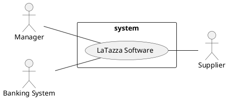
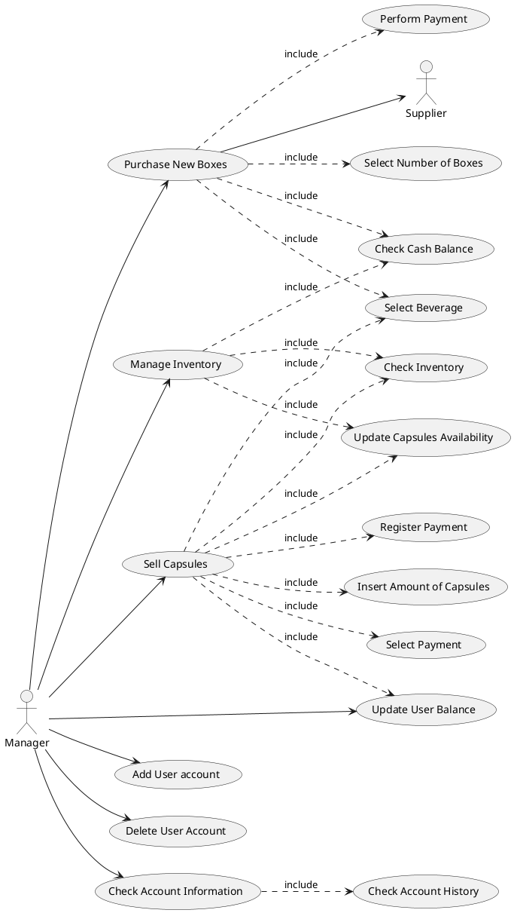
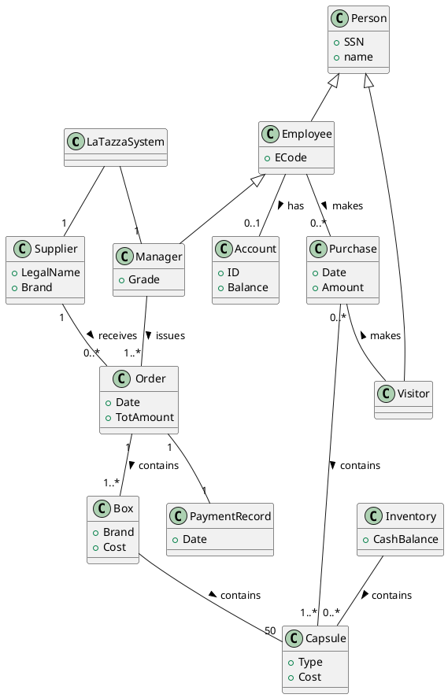
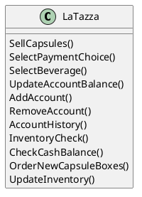

# Requirements Document

Authors:

* 259455 - Gianluca Amprimo
* ? - Francesco Chimienti
* 257447 - Antonio Ettore Epifani
* 257387 - Andrea Simone Foderaro

Date: 25 Aug 2019

Version: 1.0

# Contents

- [Stakeholders](#stakeholders)
- [Context Diagram and interfaces](#context-diagram-and-interfaces)
	+ [Context Diagram](#context-diagram)
	+ [Interfaces](#interfaces)

- [Functional and non functional requirements](#functional-and-non-functional-requirements)
	+ [Functional Requirements](#functional-requirements)
	+ [Non functional requirements](#non-functional-requirements)
- [Use case diagram and use cases](#use-case-diagram-and-use-cases)
	+ [Use case diagram](#use-case-diagram)
	+ [Use cases](#use-cases)
	+ [Relevant scenarios](#relevant-scenarios)
- [Glossary](#glossary)
- [System design](#system-design)

# Stakeholders

| Stakeholder name  | Description |
| ----------------- |:-----------:|
|  Client          |  	Person who shares documents |
|	Developer			| 	Person who developed the system |

# Context Diagram and interfaces

## Context Diagram

## Interfaces
| Actor | Logical Interface | Physical Interface  |
| ------------- |:-------------:| -----:|
| Manager | GUI interface | Personal computer |
| Supplier | API to send the order | Internet connection |
| Banking system | API to allow online payment to the supplier | Internet connection |

# Stories and personas

---

# Functional and non functional requirements

## Functional Requirements

| ID        | Description  |
| ------------- |:-------------:|
|  FR 1     		| 	Sell capsules |
|  FR 1.1	     	|  	Select type of beverage|
|  FR 1.2	     	|  	Insert amount of capsules|
|  FR 1.3	    	|  	Select payment choice (Account or Cash) |
|  FR 1.4	     	|  	Register payment |
|  FR 2     		| 	Purchase new boxes |
|  FR 2.1	     	|  	Select number of boxes |
|  FR 2.2     		|  	Select type of beverage |
|  FR 2.3    	 	|  	Perform payment |
|  FR 3     		| 	Update employee balance |
|  FR 3.1    		| 	Insert amount |
|  FR 4     		| 	Check the inventory |
|  FR 5     		| 	Check the cash balance |
|  FR 6     		| 	Update cash balance |
|  FR 7     		| 	Update capsules availability |
|  FR 8     		| 	Add new employee account |
|  FR 9     		| 	Delete employee account |
|  FR 10     		| 	Check account history |
|  FR 11    		| 	Retrieve employee balance information |

_**Note**: we refer to 'Cash Balance' as the amount of money collected by the manager, that will be used for purchasing boxes of capsules._

_**Note**: with 'Register Payment' we refer to the update of the employee balance and the registration of the sale in a log file._

## Non Functional Requirements

| ID | Type (efficiency, reliability, ..)| Description  | Refers to |
| ------------- |:-------------:| :-----:| :-----:|
|  NFR 1	|	Reliability	|	Payment registration errors should be less than 5% | FR 1.4 |
|  NFR 2  | 	Efficiency	|	Account balance should be updated in less than 30s | FR 1.4 |
|  NFR 3  | 	Reliability	|	Payment errors should be less than 5% | FR 2.3 |
|  NFR 4  |	Efficiency	|	Updated balance must be visible after less than 30s | FR 3 |
|  NFR 5	|	Usability		| 	Non-trained users must be able to use the functionalities of the product in less than 2h	|  |
|  NFR 6  | 	Domain			|	Currency is in € | | |

# Use case diagram and use cases

## Use case diagram

## Use Cases

### Purchase New Boxes, UC1
| Manager, Supplier        |  |
| ------------- |:-------------:|
|  Nominal Scenario     | The manager selects the type and the quantity of products he/she wants to order and by pressing the "Place Order" button, the order will be sent to the supplier, which will deliver it |
|  Variants     | Call the supplier and place the order (in case the order is not seen from the system) |

### Sell Capsules, UC2

| Manager        |  |
| ------------- |:-------------:|
|  Nominal Scenario     | The customer goes to the manager asking for capsules; the payment method is selected (only cash if visitor); the manager will give the capsules and will record the sale. The system automatically updates the user's balance (if employee) |
|  Variants     | If the employee has no credit, he/she can still buy capsules but his/her balance will become negative: the employee shall pay the debt ASAP |

_**Note**: User balance threshold is -5€, below which the user cannot buy new capsules until he/she pays the debt._

### Add User Credit, UC3

| Manager        |  |
| ------------- |:-------------:|
|  Nominal Scenario     | An employee goes to the manager giving him cash and the manager will update the account balance with the given import  |
|  Variants     | The balance can not be updated due to a system problem: the manager gives the user the money back |

### Add User Account, UC4

| Manager        |  |
| ------------- |:-------------:|
|  Nominal Scenario     | A new employee has arrived at work, the manager will register an account for him with an ID and a balance, so that the new employee will be able to have coffee with LaTazza  |
|  Variants     | The system cannot insert another user. The new employee can affiliate with an existing employee and share the balance |

### Delete user Account, UC5

| Manager            |		     |
| -------------      |:-------------:|
|  Nominal Scenario  | An employee has been fired (or decides that he does not want a LaTazza account anymore),  the manager will delete his account, the user will not be able to have coffee with LaTazza if not as a simple visitor |
|  Variants          | The system crashes and does not delete the account. The manager can always restart the system |

### Manage Inventory, UC6

| Manager	 |	|
| -------------	 |:------:|
| Nominal Scenario | The manager wants to see how many capsules are available, and checks the inventory, together with the available cash; the manager can also update the capsules availability |
| Variants	 | The inventory does not respond: the manager restarts the system or checks if the inventory file is corrupted |

### Check Account Information, UC7

| Manager	 |	|
| -------------	 |:------:|
| Nominal Scenario | The manager wants to see the history of purchases performed by a particular user with its balance |
| Variants	 | The user has not performed any purchase yet: the account history will be empty |

# Relevant scenarios

### Scenario 1: Successful purchase of boxes from supplier

 **Precondition**:  Enough money should be present in the cash balance.

 **Post condition**: Selected products shall be delivered.

| Scenario ID: SC1        | Corresponds to UC: Purchase New Boxes |
| ------------- |:-------------:|
| Step#        | Description  |
|  1     | Manager selects capsule type to order |
|  2     | Manager inserts number of capsule boxes to order |
|  3     | Pressing button "Place order" redirect to payment page of Banking System |
|  3     | LaTazza sends paid order to supplier |
|  5     | LaTazza updates cash Balance as cashBalance = cashBalance - totOrderExpense |

### Scenario 2: Employee buys capsules with account
**Precondition**: Employee has a balance above threshold and wanted capsules are available.

**Postcondition**: Employee balance and capsules inventory is updated.

| Scenario ID: SC2        | Corresponds to UC: Sell Capsules |
| ------------- |:-------------:|
| Step#        | Description  |
|  1     | Employee asks manager to buy capsules with account |
|  2     | Manager inserts capsules type and number in software |
|  3     | Manager inserts employee account info |
|  4     | LaTazza updates automatically available capsules as availCapsule = availCapsule - buyedCapsules |

### Scenario 3: Visitor buys capsules with cash
**Precondition**: Wanted capsules are available.

**Postcondition**: Cash balance and capsules inventory are updated.

| Scenario ID: SC3        | Corresponds to UC: Sell Capsules |
| ------------- |:-------------:|
| Step#        | Description  |
|  1     | Visitor asks manager to buy capsules with cash |
|  2     | Manager inserts capsules type and number in software |
|  3     | LaTazza updates automatically available capsules as availCapsules = availCapsules - buyedCapsules |
|  4     | LaTazza updates automatically cash balance available |

_**Note**: visitor can also be an employee without account._

### Scenario 4: Unsuccessful buy of Employee with account balance below threshold
**Precondition**: Wanted capsules are available, but Employee balance is below threshold.

**Postcondition**: Error message.

| Scenario ID: SC4        | Corresponds to UC: Sell Capsules |
| ------------- |:-------------:|
| Step#        | Description  |
|  1     | Employee asks manager to buy capsules with account |
|  2     | Manager inserts capsules type and number in software |
|  3     | Manager inserts employee account info |
|  4     | LaTazza blocks the sale because account balance is below threshold and shows an error message|

### Scenario 5: Employee recharge account
**Precondition**: User account exists.

**Postcondition**: User's balance increased by the payed quantity.

| Scenario ID: SC5        | Corresponds to UC: Add User credit |
| ------------- |:-------------:|
| Step#        | Description  |
|  1     | Customer asks manager to charge his account balance |
|  2     | Customer gives cash to load to Manager |
|  3     | Manager inserts User account information and recharge amount in the software |
|  4     | LaTazza updates account Balance as AccountBalance = AccountBalance + recharge and cashBalance as cashBalance = cashBalance + recharge |

### Scenario 6: Manager adds a new account for a user
**Precondition**: The user does not have an account yet.

**Postcondition**: The user owns an account with zero balance.

| Scenario ID: SC6        | Corresponds to UC: Add User account |
| ------------- |:-------------:|
| Step#        | Description  |
|  1     | Employee asks manager for an account |
|  2     | Manager registers in the software employee information (name, surname, employeeID)|
|  3     | LaTazza adds account to list with an associated balance set to 0|

### Scenario 7: Manager deletes an existing account
**Precondition**: User account exists.

**Postcondition**: The user does not have an account anymore.

| Scenario ID: SC7        | Corresponds to UC: Delete User account |
| ------------- |:-------------:|
| Step#        | Description  |
|  1     | Registered employee leaves the company or the LaTazza buyer group |
|  2     | Manager insert employeeID in the software and select delete button|
|  3     | LaTazza removes account and related information |
|  4     | LaTazza shows balance residue to give back to Employee |
|  5     | Manager gives cash back to Employee |

### Scenario 8: Manager inserts new capsules in inventory

 **Precondition**: New capsules are available.

 **Post condition**: Inventory is updated.

| Scenario ID: SC8        | Corresponds to UC: Manage inventory |
| ------------- |:-------------:|
| Step#        | Description  |
|  1     | Manager selects capsule type to insert |
|  2     | Manager inserts number of capsule to insert |
|  3     | LaTazza updates inventory |

# Glossary

_**Note**: we assumed the LaTazza software is connected to only one supplier of capsule boxes._

# System Design

